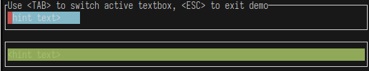

[![CI Badge]][CI]
[![Crate Badge]][Crate]
[![Docs Badge]][Docs]

[CI Badge]: https://img.shields.io/github/actions/workflow/status/benjajaja/ratatui-image/ci.yaml?style=flat-square&logo=github
[CI]: https://github.com/benjajaja/ratatui-image/actions?query=workflow%3A
[Crate Badge]: https://img.shields.io/crates/v/tui-textbox?logo=rust&style=flat-square
[Crate]: https://crates.io/crates/tui-textbox
[Docs Badge]: https://img.shields.io/docsrs/ratatui-image?logo=rust&style=flat-square
[Docs]: https://docs.rs/tui-textbox/0.1.0/

# Tui-textbox

Stateful widget for [ratatui](https://github.com/ratatui-org/ratatui).

## Example

Check `example/`.

To run demo:

```shell
cargo run --example demo
```



## Features

- Stateful
- Support moving cursor `Left` and `Right`
- `Backspace` and `Delete` supported
- Paste from clipboard
